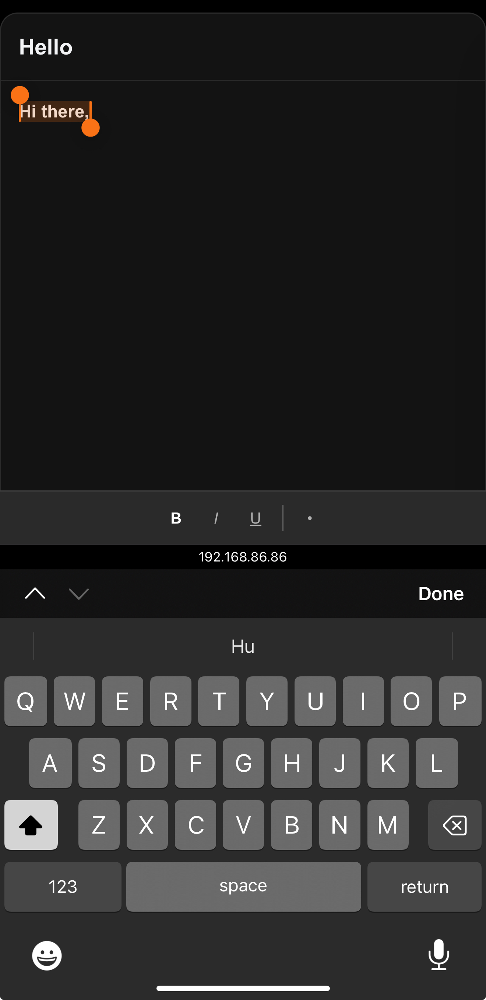

# Email Editor

## Overview
A rich text email editor built with Next.js and TipTap, designed with clean engineering principles and modern UI/UX.

## Screenshots

### Light Mode


### Dark Mode


### Mobile View


## Architecture

### Core Technologies
- **Next.js 15.4.6** - React framework
- **TipTap** - Headless rich text editor
- **TypeScript** - Type safety
- **Tailwind CSS** - Utility-first styling

### Project Structure
```
src/
├── app/                    # Next.js app router
├── components/            # React components
│   ├── EmailComposer/    # Main composer container
│   └── EmailEditor/      # Editor and toolbar components
├── constants/            # Centralized configuration
├── hooks/               # Custom React hooks
├── types/               # TypeScript definitions
└── utils/               # Utility functions
```

## Key Features

### 1. Platform-Adaptive UI
- **Desktop**: Floating toolbar above selected text
- **Mobile**: Fixed toolbar above virtual keyboard
- Device detection based on user agent, not window width

### 2. Neumorphic Design
- Soft shadows and gradients
- Dark/light mode support
- Smooth animations and transitions

### 3. Mobile Keyboard Handling
- Uses Visual Viewport API for accurate keyboard detection
- Toolbar positioning adapts to keyboard height
- Debounced updates for smooth performance

## Development Commands

```bash
# Install dependencies
npm install

# Run development server
npm run dev

# Build for production
npm run build

# Run linting
npm run lint

# Type checking
npm run typecheck
```

## Testing on Mobile Devices

To test the editor on your mobile device:

1. Start the development server:
   ```bash
   npm run dev
   ```

2. Find your local IP address:
   - On Mac: `ifconfig | grep "inet " | grep -v 127.0.0.1`
   - On Windows: `ipconfig`

3. Access the app on your mobile device using your local IP:
   ```
   http://[YOUR_IP_ADDRESS]:3000
   ```
   
   Example: `http://192.168.86.86:3000`

4. Make sure your mobile device is on the same WiFi network as your development machine

Note: The mobile toolbar will automatically appear above the keyboard when you focus on the editor.